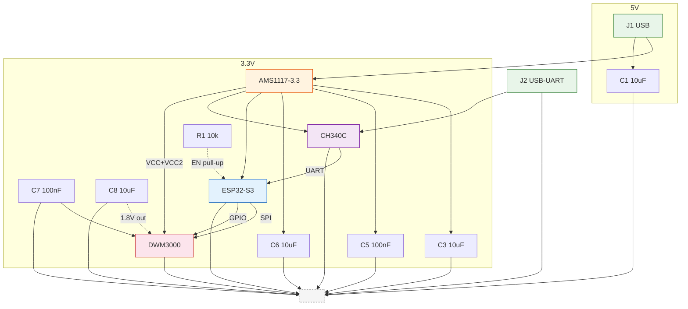

# Аппаратная схема UWB-узла (Stage 0)

## Состав на один узел

| Компонент                    | Назначение                    | Примечание                      |
| ---------------------------- | ----------------------------- | ------------------------------- |
| ESP32-S3 (ESP32-S3-WROOM-1)  | Главный контроллер            | SPI, UART, GPIO                 |
| DWM3000                      | UWB-трансивер                 | IEEE 802.15.4z, модуль с антенной |
| LDO 3.3 В (AMS1117-3.3)     | Питание                       | От LiPo / USB, фикс. 3.3В      |
| USB-UART (CH340C)            | Отладка + лог                 | Только для стенда               |
| C1 — 10μF                    | Входной фильтр LDO            | Перед AMS1117 IN–GND           |
| C3 — 10μF                    | Выходной фильтр LDO           | После AMS1117 OUT–GND          |
| C5 — 100nF                   | Высокочастотный байпас ESP32  | Рядом с VDD33                   |
| C6 — 10μF                    | Низкочастотный накопитель ESP32 | Рядом с VDD33                 |
| C7 — 100nF                   | Высокочастотный байпас DWM3000 | Рядом с VCC/VCC2               |
| C8 — 10μF                    | Развязка внутр. регулятора 1.8В DWM3000 | Между VDD и GND        |
| R1 — 10k                     | Pull-up EN ESP32              | К 3.3V                          |


## Структурная схема узла



## Соединение ESP32-S3 ↔ DWM3000 (SPI)

```
ESP32-S3           DWM3000 (24-pin QFN модуль)
────────           ───────────────────────────
GPIO 10 (SPI CS)   →  CS
GPIO 11 (SPI MOSI) →  MOSI
GPIO 12 (SPI MISO) ←  MISO
GPIO 13 (SPI SCK)  →  SCK
GPIO 14            →  RSTn
GPIO 15            ←  IRQ
3.3V               →  VCC / VCC2
GND                →  GND
```

> Пин-аут требует сверки с даташитом DWM3000 (Qorvo). В отличие от DWM1000, у DWM3000 часть пинов переключена. Перед разводкой платы обязательно сверить назначение по документации.

## Питание

```
LiPo 3.7V → LDO 3.3V → ESP32-S3 VDD33
                     → DWM3000 VCC + VCC2 (3.3V, оба пина)

DWM3000 VDD — выход внутреннего регулятора 1.8В (C8 между VDD и GND)
```

## Стенд для Stage 1 (два узла)

```
[USB]──[ESP32 #1]──[UWB] ~~~~~~~~ [UWB]──[ESP32 #2]──[USB]
         │                                            │
      UART(лог)                                   UART(лог)
```

- Оба узла идентичны по схеме.
- Питание через USB от ноутбука.
- Связь UWB — двусторонняя дальнометрия (TWR).

## Альтернативные пины для кастомной платы

Если SPI-порты заняты, можно использовать HSPI (GPIO 26–29) вместо SPI2:

```
HSPI: CS=26, MOSI=27, MISO=28, SCK=29
```

## Известные проблемы схемы

- Пин-аут DWM3000 требует верификации — в текущей схеме используются предположительные соединения по аналогии с DWM1000.
